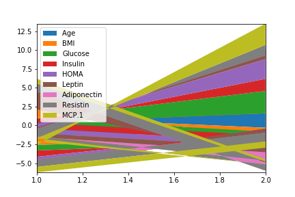

# Breast-Cancer-Classification
This project is based on the analysis of Breast Cancer. Here we predicted the possibility of Breast Cancer using certain parameters through Logistics Regression, KNN, SVM, Kernel SVM, Naive Bias, Decesion Tree Classification and Random Forest Classification. We got an accuracy of 83.33% with KNN classification. 

<b><u>Data Set Information:</u></b> 
There are 10 predictors, all quantitative, and a binary dependent variable, indicating the presence or absence of breast cancer. 
The predictors are anthropometric data and parameters which can be gathered in routine blood analysis. 
Prediction models based on these predictors, if accurate, can potentially be used as a biomarker of breast cancer.

<b><u>Attribute Information:</u></b> 

Quantitative Attributes:  
Age (years)  
BMI (kg/m2)  
Glucose (mg/dL)  
Insulin (µU/mL)  
HOMA  
Leptin (ng/mL)   
Adiponectin (µg/mL)   
Resistin (ng/mL)  
MCP-1(pg/dL)  

Labels:  
1=Healthy controls   
2=Patients  

<b>Stack Plots for Comparison of Data</b> 
Expected  
 
Result  

